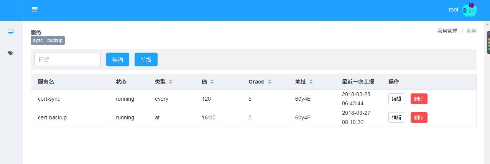
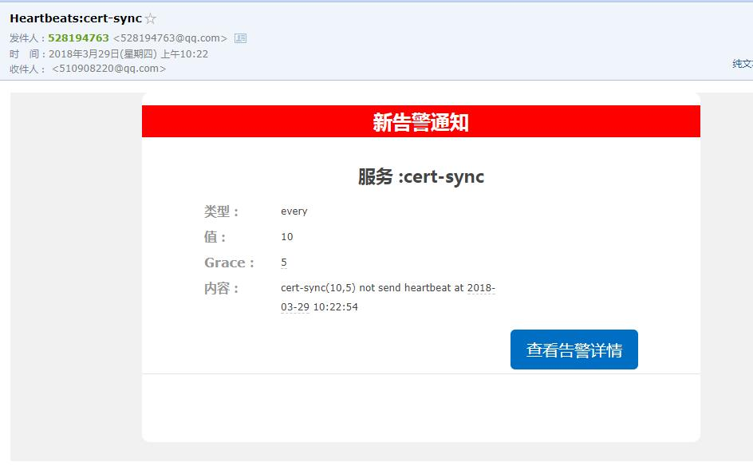
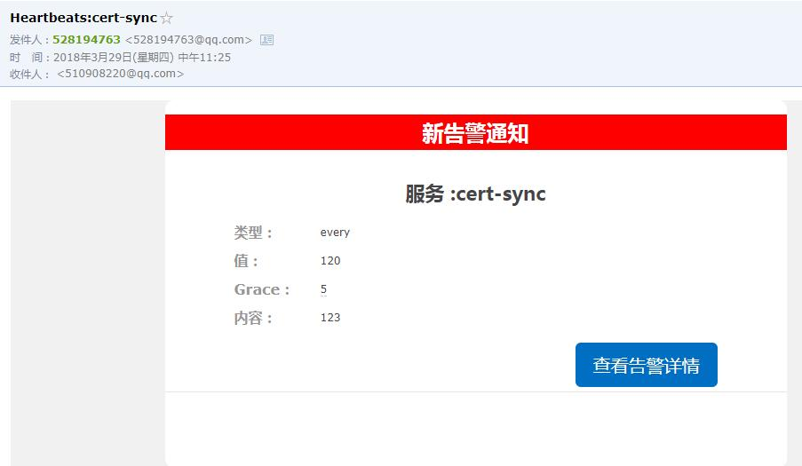
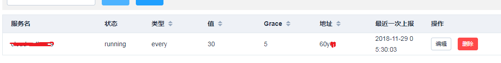

# Heartbeats

简单描述就是一个基于数据上报的监控系统. 主要监控如下两种情形:

- 间隔逻辑:比如每5分钟执行一段逻辑
- 定点逻辑:比如每天17:00执行一段逻辑

监控系统是根据逻辑执行完后上报一条数据来判断被监控服务是否正常.

## 介绍



上面是被监控服务的一个界面.上面添加了两个被监控的服务.

####  cert-sync

每两个小时同步一次数据, 理论上每120分钟就会有一条上报的数据. 考虑到执行逻辑本身的耗时,Grace就是来控制额外耗时的. 相当于是每125分钟就会有一个上报数据,否则就会告警.


#### cert-backup

每天下午16:05进行一次数据备份, 如果在16:05~今天结束点没有检测到上报的数据就进行告警.


另外还支持标签,可以给每个服务打多个标签,然后可以根据标签进行服务搜索. 搜索时多个标签用逗号分隔.

## 告警

普通告警:到点没上上报数据导致触发告警



根据上报的 data告警

例如:`curl -u root:'xxxx' -X POST 'http://192.168.0.1/api/pings/?service=60y4E&&data=123'`



## 数据上报方式

假设服务器地址是`http://192.168.0.1`，这里列举两种上报方式:

(1) linux命令方式:

```bash
curl -u root:'xxxx' -X POST 'http://192.168.0.1/api/pings/?service=60y4E&&data=xxx'
```

这里简单说一下各个字段含义:

- service:60y4E是在创建服务cert-sync时生成的一个短地址.
- data:如果这个字段不为空的话, 后台会触发一个告警. 一般可以使用这个上报一些错误.
- `-u root:'xxxx' `这个是后台的账号和密码,后台加入了权限.

(2) python方式:

```python
import requests
r = requests.post('http://192.168.0.1/api/pings/?service=60y4E&&data=2222', auth=('root', 'xxxx'))
```


## 使用方式

- 修改`email.env`里的邮件配置.
- 修改`db.env`数据库配置,我用的是 mysql,并创建数据库`CREATE DATABASE heartbeats CHARACTER SET utf8 COLLATE utf8_general_ci;`
- 修改`src/front/src/api/api.js`里的`base`和`Server`为宿主机映射容器的地址. 比如宿主机是`192.168.0.1`, 那么需要修改为`192.168.0.1:5827`, 具体端口号是`docker-compose.yml`里指定的.
- 切换到目录下,执行:`docker-compose build && docker-compose up -d`
- 执行`docker exec -it heartbeats_web_1 pipenv run python src/manage.py createsuperuser`创建管理员用户. 在上报数据的时候需要一个授权. 或者可以创建一个通用账号专门用于上报数据.
- 打开`http://宿主机ip:5827/`就能使用服务了.


## agent

agent支持远程从配置里的机器采集数据, 然后汇总上报给服务器。这样相当于一个小的监控节点了。

- 注册一个新的服务

- 将信息填入模板，根据实际定制, 例如:

    

- 修改配置:

  `agent/config.yaml`

  - SERVICE：服务名称,如上图的"地址"字段
  - CHECK_INTERVAL_MIN:检查间隔,如上图的"值"
  - KEY:  当前机器登陆租户内其他机器的秘钥

  接着修改要监控的目标IP, 例子里都是云端认证的监控项. 基本都是

  - 内存
  - CPU
  - 磁盘
  - 进程

- 部署开始监控

  根据设备监控的间隔，例如

  ```bash
  */30 * * * *  python /opt/agent.py  
  ```

## 注意 

后台都是采用的 UTC时间存储的, 实际检测逻辑是按照`Asia/Shanghai`时区进行的. 界面上显示的时间也是UTC的. 

